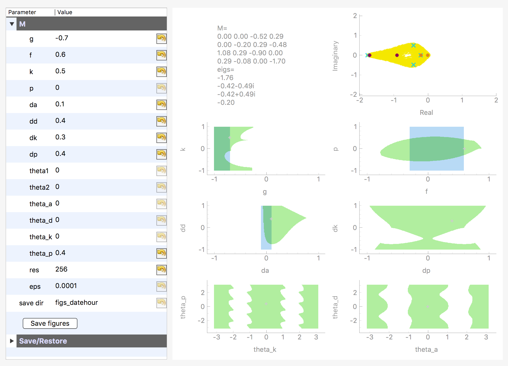

## Install
1. Install requirements in a virtual environment

```
python3 --version
virtualenv env --python=python3
source env/bin/activate
pip install -r requirements.txt
```

Make sure you have a high enough python version (3.7 works).

## Launch demos
Run 
```
source env/bin/activate
```
once per terminal.

Then, run
```
cd demos
python3 stability4x4.py
```
for the interacting with the 
stability and optimality regions of a 4x4 smooth game derivative.


